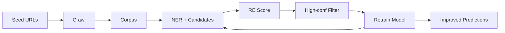

# Corpus Crawler & Self-Training Pipeline

## Overview

This pipeline enables **automatic corpus collection, annotation, and self-training** for the GroundKG relation extraction system. It crawls documents, extracts text, runs ML inference, and uses high-confidence predictions to retrain the model.

## Architecture

```
Seed URLs (seed.csv)
    ↓
[crawl.py] → Download & extract text
    ↓ (data/corpus/*.txt + data/meta.jsonl)
[pack_corpus] → NER → Candidates → RE Scoring
    ↓ (out/pack.scored.jsonl)
[auto_train] → Select high-conf examples → Retrain
    ↓ (models/promoter_v1.onnx updated)
[edges_from_pack] → Promote scored to edges + graph
```

## 📁 File Structure

```
data/
  seed.csv              # Input: URLs to crawl
  raw/                  # Downloaded HTML/PDF files
  corpus/               # Extracted text files
  meta.jsonl            # Metadata for each document
tools/
  crawl.py              # Web crawler with PDF/HTML support
  build_manifest.py     # Generate docs.yaml manifest
  select_training_from_scored.py  # Self-training data selection
groundkg/
  re_score.py           # Score candidates with probabilities
models/
  promoter_v1.onnx      # Trained model
  thresholds.json       # Confidence thresholds
  classes.json          # Class labels
out/
  pack.ner.jsonl        # NER results for corpus
  pack.candidates.jsonl # Entity pairs
  pack.scored.jsonl     # Scored predictions
```

## 🚀 Quick Start

### 1. Install Additional Dependencies

```bash
pip install -r requirement.txt
```

New dependencies:
- `requests` - HTTP client
- `trafilatura` - HTML text extraction
- `pdfminer.six` - PDF text extraction
- `beautifulsoup4` - HTML parsing
- `python-slugify` - Safe filenames

### 2. Configure Seed URLs

Edit `data/seed.csv`:

```csv
doc_id,url,license,lang
eur_nis2,https://eur-lex.europa.eu/legal-content/EN/TXT/?uri=CELEX:32022L2555,CC-BY-4.0,en
eur_ai_act,https://eur-lex.europa.eu/legal-content/EN/TXT/?uri=CELEX:52021PC0206,CC-BY-4.0,en
wikipedia_ai,https://en.wikipedia.org/wiki/Artificial_intelligence,CC-BY-SA-4.0,en
```

### 3. Crawl & Build Corpus

```bash
# Download documents and extract text
make crawl

# Generate manifest (docs.yaml)
make manifest

# Verify
ls -lh data/corpus/
head data/meta.jsonl
```

### 4. Process Corpus Pack

```bash
# Run NER, candidate generation, and RE scoring on entire corpus
make pack_corpus

# View statistics
make pack_stats

# Output:
# Pred counts in pack:
#   1523 none
#    142 type
#     87 headquartered_in
#     45 performs_task
#     23 consists_of
#     12 covered_by
```

### 5. Self-Training (Automatic Retraining)

```bash
# Select high-confidence predictions and retrain model
make auto_train

# With custom thresholds:
GK_POS_THR=0.97 GK_NEG_THR=0.98 GK_MAX_PER_CLASS=1000 make auto_train
```

### 6. Produce Edges & Graph

```bash
# Promote scored predictions to edges and export TTL
make edges_from_pack
make verify
make hash
```

## 🔧 Components

### 1. Web Crawler (`tools/crawl.py`)

**Features:**
- ✅ Respects `robots.txt`
- ✅ HTML & PDF support
- ✅ Rate limiting (0.2s delay)
- ✅ Size limits (25 MB max)
- ✅ SHA-256 checksums
- ✅ Metadata tracking

**Text Extraction:**
- HTML: `trafilatura` (high quality) + BeautifulSoup fallback
- PDF: `pdfminer.six`

**Output:**
- Raw files: `data/raw/<doc_id>.(html|pdf)`
- Text files: `data/corpus/<doc_id>.txt`
- Metadata: `data/meta.jsonl`

### 2. Manifest Builder (`tools/build_manifest.py`)

Generates `docs.yaml` with provenance:

```yaml
- doc_id: eur_nis2
  title: "Directive (EU) 2022/2555 on cybersecurity"
  url: https://example.com/nis2.pdf
  license: CC-BY-4.0
  sha256: abc123...
```

### 3. RE Scorer (`groundkg/re_score.py`)

Runs ONNX model inference and outputs probabilities:

```json
{
  "doc_id": "eur_nis2",
  "sent_start": 1234,
  "text": "The directive applies to essential entities.",
  "subject": {"text": "directive", "start": 4, "end": 13, "label": "LAW"},
  "object": {"text": "essential entities", "start": 25, "end": 43, "label": "ORG"},
  "pred": "covered_by",
  "prob": 0.967
}
```

### 4. Training Data Selector (`tools/select_training_from_scored.py`)

**Self-training logic:**
- Selects examples where `prob >= POS_THR` for positive classes
- Selects examples where `pred == "none"` and `prob >= NEG_THR`
- Caps per class to avoid imbalance
- Randomizes and splits 80/20 train/dev

**Environment variables:**
- `GK_POS_THR`: Positive threshold (default: 0.95)
- `GK_NEG_THR`: Negative threshold (default: 0.95)
- `GK_MAX_PER_CLASS`: Max examples per class (default: 500)

## 📊 Typical Workflow

### Bootstrap (First Time)

```bash
# 1. Create initial training data manually
cat > training/re_train.jsonl <<EOF
{"text":"[E1]Tesla[/E1] is headquartered in [E2]Austin[/E2].","label":"headquartered_in"}
{"text":"[E1]ACME[/E1] is a [E2]Digital Service Provider[/E2].","label":"type"}
{"text":"[E1]Neural networks[/E1] are used for [E2]pattern recognition[/E2].","label":"performs_task"}
EOF

# 2. Train initial model
python training/train_re_sklearn.py

# 3. Crawl corpus
make crawl
make manifest

# 4. Process corpus with initial model
make pack_corpus
make pack_stats

# 5. Self-train (retrain from high-confidence predictions)
make auto_train

# 6. Verify improved model
make demo
```

### Iterative Improvement

```bash
# Add more URLs to data/seed.csv
# Then:

make crawl           # Download new docs
make manifest        # Update docs.yaml
make pack_corpus     # Process with current model
make pack_stats      # Check prediction distribution

# Retrain with stricter thresholds
GK_POS_THR=0.98 GK_NEG_THR=0.99 GK_MAX_PER_CLASS=2000 make auto_train

# Finalize edges
make edges_from_pack
```

## 🎛️ Configuration

### Crawler Settings (`tools/crawl.py`)

```python
TIMEOUT = 20           # HTTP timeout (seconds)
MAX_BYTES = 25_000_000 # Max file size (25 MB)
UA = "GroundKGFetcher/1.0 (+https://groundkg.com)"
```

### Candidate Settings (`groundkg/candidates.py`)

```python
MAX_CHAR_DIST = 150         # Max distance between entities
MAX_PAIRS_PER_SENT = 10     # Max pairs per sentence
```

### Self-Training Thresholds

```bash
# Conservative (high precision)
GK_POS_THR=0.98 GK_NEG_THR=0.99 GK_MAX_PER_CLASS=300

# Balanced
GK_POS_THR=0.95 GK_NEG_THR=0.95 GK_MAX_PER_CLASS=500

# Aggressive (higher recall)
GK_POS_THR=0.90 GK_NEG_THR=0.90 GK_MAX_PER_CLASS=1000
```

## 📈 Monitoring & Analysis

### View Corpus Stats

```bash
# Document count
ls data/corpus/*.txt | wc -l

# Total tokens (approx)
wc -w data/corpus/*.txt | tail -1

# Average document length
for f in data/corpus/*.txt; do wc -w < $f; done | awk '{s+=$1} END {print s/NR}'
```

### Analyze Predictions

```bash
# Predicate distribution
jq -r '.pred' out/pack.scored.jsonl | sort | uniq -c | sort -nr

# High-confidence predictions
jq 'select(.prob > 0.95)' out/pack.scored.jsonl | jq -s 'group_by(.pred) | map({pred: .[0].pred, count: length})'

# Low-confidence (may need review)
jq 'select(.prob < 0.60)' out/pack.scored.jsonl | head -10

# Sample by predicate
jq 'select(.pred == "headquartered_in" and .prob > 0.9)' out/pack.scored.jsonl | head -5
```

### Training Data Quality

```bash
# Check balance
jq -r '.label' training/re_train.jsonl | sort | uniq -c

# View samples per class
for cls in type covered_by headquartered_in consists_of performs_task none; do
  echo "=== $cls ===";
  jq "select(.label == \"$cls\")" training/re_train.jsonl | head -2;
done
```

## 🔄 Continuous Improvement Loop



**Workflow:**
1. Add more URLs → `make crawl`
2. Process corpus → `make pack_corpus`
3. Check quality → `make pack_stats`
4. Retrain → `make auto_train`
5. Evaluate → `make demo`
6. Repeat!

## ⚠️ Best Practices

### Crawler Ethics
- ✅ Always respect `robots.txt`
- ✅ Use reasonable delays (0.2s minimum)
- ✅ Set appropriate User-Agent
- ✅ Check licenses before using
- ✅ Store raw files for auditing

### Self-Training Safety
- 🎯 Start with **high thresholds** (0.95+)
- 📊 Monitor class balance
- 🔍 Manually review samples before retraining
- 📈 Track model performance over iterations
- 🚫 Don't blindly trust model predictions

### Quality Control
- Inspect `data/meta.jsonl` for failed downloads
- Check for very short documents (< 200 chars)
- Review low-confidence predictions manually
- Maintain a held-out test set

## 🎯 Success Metrics

Track these over iterations:

```bash
# After each auto_train:
make pack_corpus
make pack_stats

# Track:
# 1. Total high-conf predictions (prob > 0.95)
# 2. Predicate distribution
# 3. Training set size
# 4. Model accuracy on manual test set
```

## 🆘 Troubleshooting

**Crawler fails:**
- Check internet connection
- Verify URL accessibility
- Check disk space
- Review error messages in stderr

**Empty pack.scored.jsonl:**
- Ensure corpus files exist: `ls data/corpus/`
- Verify model exists: `ls models/promoter_v1.onnx`
- Check NER output: `head out/pack.ner.jsonl`

**Poor self-training results:**
- Lower thresholds: `GK_POS_THR=0.90`
- Increase examples: `GK_MAX_PER_CLASS=1000`
- Add more seed URLs
- Manually review training data

## 📚 Example Seed URLs

```csv
doc_id,url,license,lang
eur_nis2,https://eur-lex.europa.eu/legal-content/EN/TXT/?uri=CELEX:32022L2555,CC-BY-4.0,en
eur_gdpr,https://eur-lex.europa.eu/legal-content/EN/TXT/?uri=CELEX:32016R0679,CC-BY-4.0,en
eur_ai_act,https://eur-lex.europa.eu/legal-content/EN/TXT/?uri=CELEX:52021PC0206,CC-BY-4.0,en
wiki_kg,https://en.wikipedia.org/wiki/Knowledge_graph,CC-BY-SA-4.0,en
wiki_nlp,https://en.wikipedia.org/wiki/Natural_language_processing,CC-BY-SA-4.0,en
```

---

**Ready to scale!** This pipeline enables continuous learning from web documents, making your knowledge graph extraction system progressively better over time. 🚀

